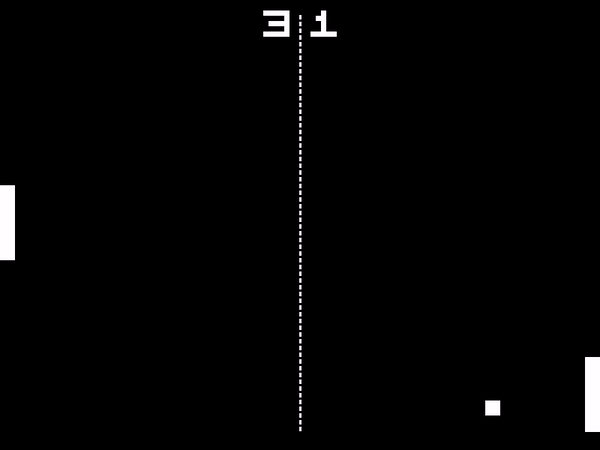

# Proyek Kelompok 5 : Pong
Proyek Akhir Pemrograman Lanjut Teknik Komputer 2018 Kevin Darmawan (1806148744), Muhammad Farhan Almasyhur (1806200375)
## Visual
### Menu awal start screen

### Game pong


## Code
Referensi dari pembuatan program ini yaitu SDLlib (https://wiki.libsdl.org/)
Berikut beberapa kodingan yang ada pada proyek ini
### Enemy using Bot Code
```
void bot_enemy (struct Racket* enemy, const struct PongBall* ball) {
  float pong_middle_y, middle_y, diff, abs_diff;
	middle_y = enemy->y + RACKET_HEIGHT / 2.0f;
	pong_middle_y = ball->y + PONG_BALL_SIZE / 2.0f;
	diff = middle_y - pong_middle_y;
	abs_diff = fabsf(diff);
	if (abs_diff <= ENEMY_WAIT_TOLERANCE) {
		enemy->dy = 0;
	}
	else {
		enemy->dy = -diff / abs_diff;
	}
}
```
### Enemy using human code
```
void
human_enemy(struct PlayState* p, SDL_Event* e) {
	const Uint8* state = SDL_GetKeyboardState(NULL);
	if (state[SDL_SCANCODE_UP]) {
		p->enemy.dy = -1;
		return;
	}
	if (state[SDL_SCANCODE_DOWN]) {
		p->enemy.dy = 1;
		return;
	}
	p->enemy.dy = 0;
  }
```

### Main menu
```
int menu(SDL_Window* window, SDL_Renderer* renderer, Screen* gameScreen) {
	int done = 0;
	int nplayer = 0;

	while(!done)
	{
		SDL_Event event;
		
		SDL_RenderClear(renderer);

		SDL_SetRenderDrawColor(renderer, WHITE);

		SDL_Rect bg = { 0, 0, WIDTH, HEIGHT };
		SDL_Rect rect = { gameScreen->x, gameScreen->y, 25, 25 };
		SDL_Rect titleBox = { (WIDTH / 4) + 10, HEIGHT / 5, TITLE_SIZE };
		SDL_Rect menuBox = { 230, 230, MENU_BOX };

		SDL_RenderCopy(renderer, gameScreen->backgroundTex, NULL, &bg);
		SDL_RenderCopy(renderer, gameScreen->titleTex, NULL, &titleBox);
		SDL_RenderCopy(renderer, gameScreen->texture, NULL, &rect);
		SDL_RenderCopy(renderer, gameScreen->playerTex, NULL, &menuBox);
		SDL_RenderPresent(renderer);

		while (SDL_PollEvent(&event))
		{
			switch (event.type)
			{
			case SDL_WINDOWEVENT_CLOSE:
			{
				if (window)
				{
					SDL_DestroyWindow(window);
					window = NULL;
					done = 1;
				}
				break;
			case SDL_KEYDOWN:
			{
				switch (event.key.keysym.sym)
				{
				case SDLK_ESCAPE:
					done = 1;
					break;
				case SDLK_UP:
					nplayer = 1;
					gameScreen->y = FIRST;
					break;
				case SDLK_DOWN:
					nplayer = 2;
					gameScreen->y = SECOND;
					break;
				case SDLK_RETURN:
					done = 1;
					break;
				}
			}
			break;
			}
			case SDL_QUIT:
				done = 1;
				break;
			}
		}
		SDL_Delay(10);
	}
	return nplayer;
}
```

### 
